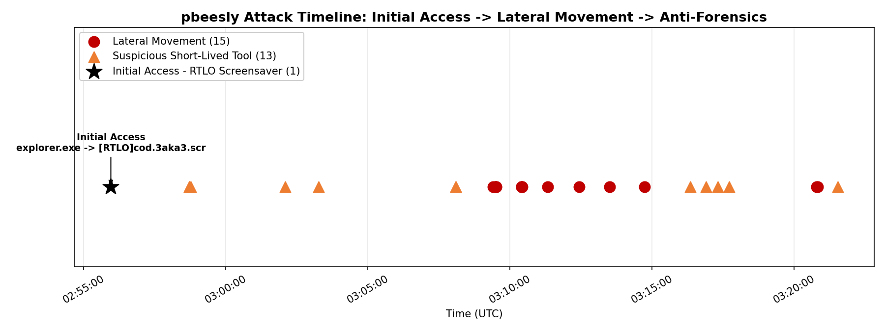
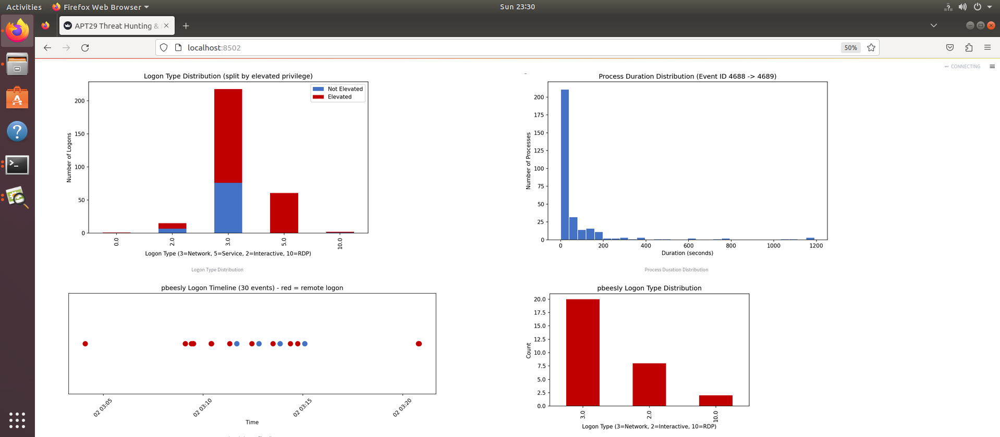
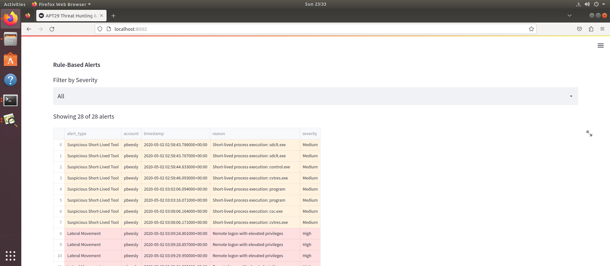
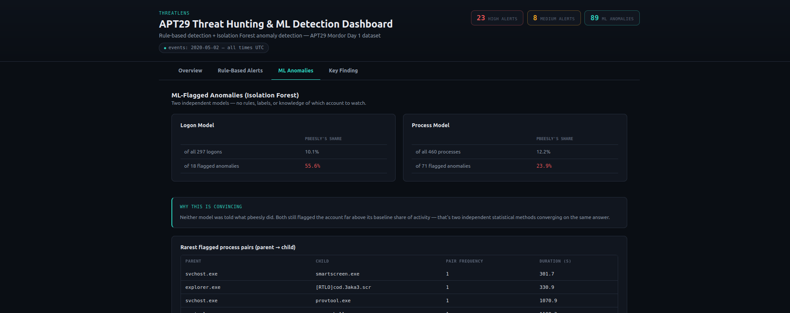
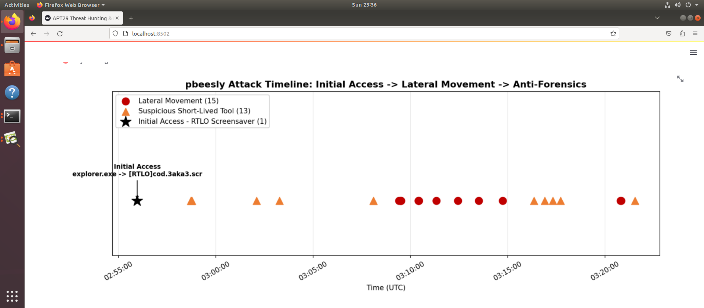

# ThreatLens

**Detecting a device breach using manual analysis and unsupervised AI.**

An AI-assisted Windows Event Log threat hunter that combines rule-based
detection with unsupervised machine learning to identify a real attack
pattern in a simulated intrusion dataset — built as my first hands-on
cybersecurity project.




## Skills Demonstrated

- Querying and extracting structured data from Elasticsearch via Python
- Translating known attacker techniques (MITRE ATT&CK-aligned) into
  engineered detection features
- Building explainable, rule-based security alerting
- Applying unsupervised machine learning (Isolation Forest) for anomaly
  detection without labeled training data
- Cross-validating independent detection methods against each other
- Building an interactive data dashboard for non-technical stakeholders

## Results at a Glance

| Metric | Value |
|---|---|
| Events analyzed | 297 logons, 460 process executions |
| Rule-based alerts generated | 28 (18 High, 10 Medium severity) |
| ML-flagged anomalies | 107 |
| Compromised account identified | Confirmed by both detection methods independently |

## What This Project Does

This project ingests Windows Security Event Logs from a simulated APT29
intrusion, engineers detection-relevant features from raw log fields, and
applies two independent layers of detection:

1. **Rule-based alerting** — explicit, explainable rules built from known
   attacker behaviors (lateral movement via remote + privileged logons,
   suspicious short-lived process executions, malicious parent-child
   process relationships).
2. **Unsupervised anomaly detection** — an Isolation Forest model that
   flags statistically unusual logons and process executions *without*
   being told what to look for, used to validate the rule-based findings
   and catch anything the rules missed.

Both layers independently converged on the same compromised account,
confirming a single coherent attack across initial access, lateral
movement, and anti-forensics activity.

## The Key Finding

A single account (`pbeesly`) showed a complete, three-stage attack pattern:

**1. Initial Access (02:55:57)** — A process disguised using a Unicode
right-to-left override character was launched from a temporary directory,
designed to make a malicious executable visually appear to have a harmless
file extension. This exact process relationship occurred only once across
the entire dataset and was independently flagged by the Isolation Forest
model — before any rule existed to catch this specific technique.

**2. Lateral Movement (03:04–03:21, ~17 minutes)** — The account generated
30 logon events across three different logon methods (network, interactive,
and remote desktop) from four distinct source locations. Fifteen of these
sessions were both remote *and* privilege-elevated, triggering high-severity
alerts.

**3. Anti-Forensics (interspersed throughout)** — Thirteen short-lived
process executions, including three runs of a secure-deletion tool used to
overwrite file data and prevent forensic recovery, alongside compiler
tools and an archiving utility consistent with on-target compilation and
data staging.

### Cross-Validation: Rules vs. Machine Learning

The Isolation Forest model was given no rules, labels, or prior knowledge
of which account or behavior to flag. Despite this, it independently
surfaced the same account as anomalous, at a rate far above its baseline
share of activity:

| Domain | Account's share of all events | Account's share of flagged anomalies |
|---|---|---|
| Logons | 10.1% | 55.6% |
| Processes | 16.0% | 21.3% |

| Detection Method | Result |
|---|---|
| Rule-based alerts | 28 total (18 High, 10 Medium severity) |
| ML-flagged anomalies | 107 total |

## How It Works

```
Raw Windows Event Logs (Elasticsearch)
        │
        ▼
  Data Extraction          → structured event data
        │
        ▼
  Feature Engineering       → remote/elevated logon flags,
        │                     process duration, parent-child
        │                     pairing rarity, etc.
        ▼
  ┌─────────────┴─────────────┐
  ▼                           ▼
Rule-Based Alerts      Isolation Forest
  │                           │
  └─────────────┬─────────────┘
                ▼
       Interactive Dashboard
```

**Tech stack:** Elasticsearch (log storage/querying), Python, pandas
(data processing), scikit-learn (Isolation Forest), matplotlib (EDA
visualizations), Streamlit (interactive dashboard).

## Dashboard

The project includes an interactive dashboard with four views:

- **EDA** — distribution charts for logon types, process durations, and
  the flagged account's activity pattern
- **Rule-Based Alerts** — filterable, severity-highlighted alert table
- **ML Anomalies** — anomaly tables from both detection models
- **Key Finding** — the full attack narrative with a combined timeline
  visualization and supporting evidence

| EDA | Rule-Based Alerts |
|---|---|
|  |  |

| ML Anomalies | Key Finding |
|---|---|
|  |  |

## Running This Project

1. Set up an Elasticsearch instance with Windows Security Event Log data
   ingested (this project used the publicly available APT29 Mordor Day 1
   dataset)
2. Run `extract_apt29_data.py` to pull relevant events into a CSV
3. Run `feature_engineering.py` to build detection features
4. Run `eda_analysis.py` to generate exploratory charts
5. Run `alert_rules.py` to generate rule-based alerts
6. Run `anomaly_detection.py` to run the Isolation Forest models
7. Run `attack_timeline_chart.py` to generate the combined timeline
8. Launch the dashboard: `streamlit run dashboard.py`

## What I Learned

This was my first end-to-end security data project, and it pushed me
through the full pipeline a SOC analyst or detection engineer would
actually use: pulling and structuring raw log data, translating known
attacker techniques into code, validating findings against an independent
statistical model, and presenting results in a way a non-technical
stakeholder could follow. The strongest lesson was seeing rule-based
detection and machine learning agree on the same finding from two
completely different approaches — that convergence is what gives a SOC
analyst real confidence in an alert.

## Next Steps

- Expand the rule set to cover additional MITRE ATT&CK techniques
- Test the pipeline against additional simulated intrusion datasets
- Add automated severity scoring that blends rule-based and ML signals
